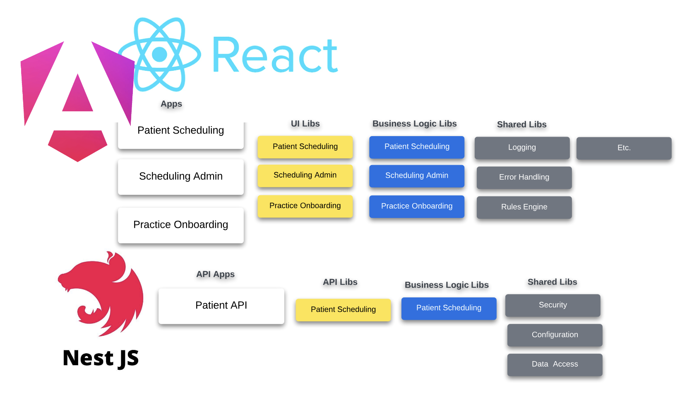

# **Monorepos Unleashed: Empowering Developers for Faster Innovation**

---

## **About Me**

- Matt Vaughn, Application & Solutions Architect
- [AngularArchitecture.com](https://angulararchitecture.com)
- [GitHub: buildmotion](https://github.com/buildmotion)
- [X: @AngularArch](https://twitter.com/AngularArch)
- Presentation: [https://bit.ly/monorepos-unleashed](https://bit.ly/monorepos-unleashed)

---

## **Introduction: The Monorepo Advantage**

- Simplify code management
- Streamline workflows
- Enhance collaboration

---

## **One Repository --> Multiple Projects**

---

## **Empowering Collaboration and Code Sharing**

- Enhances team collaboration (affinity)
- Facilitates sharing of libraries and components
- Tools (CLI, executors, generators)

---

## **Streamlining Dependency Management**

- Simplifies dependency management
- Automate tasks, handle versioning
- Tools: Lerna, Nx

---

## **Real-World Examples and Best Practices**

- Case studies: Medical, Financial, Commerce
- Challenges, solutions, benefits

---

## **Practical Techniques for Adoption**

- Roadmap for transition
- Migration strategies, CI/CD pipelines
- Avoiding common pitfalls

---

## **Q&A and Discussion**

---

## **Conclusion: Unlocking Development Potential**

- Transformative impact on productivity and innovation
- Encourage exploration of monorepo strategies

## **Resources**

- [Nx Workspace](https://nx.dev)
- [AngularArchitecture.com](https://angulararchitecture.com)
- [X: @AngularArch](https://twitter.com/AngularArch)
- 
---