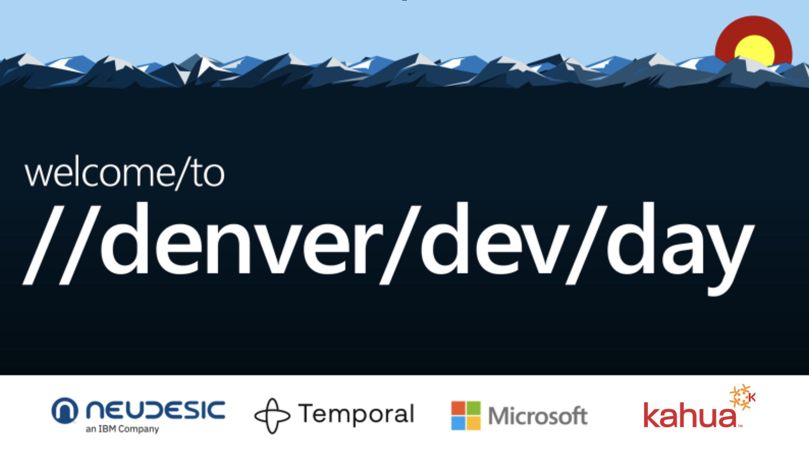

# Monorepos Unleashed



## Matt Vaughn

- email: matt@AngularArchitecture.com
- twitter: @AngularArch 
- GitHub: buildmotion

## Overview

Unleash the power of monorepos to supercharge your development process in this deep dive session. Discover how monorepos enable seamless code sharing, streamline dependency management, and empower teams to iterate rapidly, giving you a competitive edge in software delivery.

Learn valuable insights, best practices, and tooling to maximize the benefits of monorepos. Explore how monorepos facilitate efficient code sharing and collaboration, fostering innovation and productivity. Gain practical techniques for managing dependencies and versioning, ensuring a smooth development workflow.

Real-world examples from successful organizations will illustrate how monorepos drive faster innovation and increased developer productivity. By understanding their strategies, you'll gain actionable insights applicable to your own projects.

Key Takeaways:
1. Enable efficient code sharing and collaboration within and across teams using monorepos, fostering an innovative culture.
2. Effectively manage dependencies and versioning in a monorepo environment, ensuring a reliable development workflow.
3. Gain inspiration and practical guidance from real-world examples of monorepo adoption, fueling faster innovation and productivity.

Unlock the true potential of monorepos to transform your development process, boost productivity, and accelerate innovation. Join us for this enlightening session and elevate your software engineering to new heights.

## Introduction

- Brief overview of monorepos
  - many projects in one repository
- Importance in modern software development
- Objective of the talk
  - pros: benefits
  - cons: challenges

## What is a Monorepo?

- Definition and concept
- Historical context
- Comparison with polyrepo

### Modern Definition of a Monorepo in Web Development

In the context of web development, a monorepo is a version control repository that houses multiple related but distinct projects (e.g., libraries, web applications, server-side applications, etc.) in a single codebase. The monorepo approach aims to streamline various development workflows by centralizing the code, thereby making it easier to manage dependencies, coordinate commits, and share code across projects.

### Key Characteristics

1. **Centralized Version Control**: All projects are stored in a single repository, usually managed by a version control system like Git.

2. **Code Sharing**: Enables easy sharing of code and assets across multiple projects, promoting reuse and consistency.

3. **Unified Dependency Management**: All projects in the monorepo share a common set of dependencies, making it easier to manage and update libraries.

4. **Atomic Commits**: Changes across multiple projects can be committed atomically, ensuring that inter-dependent modifications are kept in sync.

5. **Build & Test Optimization**: Tooling can optimize build and test processes by only affecting the projects that were changed, thereby speeding up the CI/CD pipeline.

6. **Scalability**: Supports both small and large teams, allowing for incremental adoption as the codebase grows.

7. **Isolation**: Despite the centralized codebase, projects can be isolated enough to be developed, built, and deployed independently.

8. **Developer Experience**: Enhanced tooling and automation features, such as workspace generators, schematic builders, and more, to improve the overall developer experience.

### Popular Tools for Managing Monorepos

- **Nx**: Particularly strong in managing Angular, React, and Node.js projects, offering advanced build optimization and developer tooling.
  
- **Lerna**: Primarily used for managing JavaScript projects, particularly useful for publishing multiple packages from a single repo.
  
- **Yarn Workspaces**: Provides native support for monorepo management in Yarn, focusing on dependency management and workspaces isolation.

## Summary

The modern definition of a monorepo in web development extends beyond just storing multiple projects in a single repository. It encompasses centralized version control, code sharing, unified dependency management, build and test optimization, and enhanced developer experience. Specialized tools like Nx, Lerna, and Yarn Workspaces are often used to manage monorepos effectively, offering features that align well with enterprise-level requirements.

## History of Angular Workspace (Monorepo)

- Angular: May 2018
  - Angular version 6
- Nx: February 2019
  - Nx version 1.0 Beta

## Single Configuration

- TypeScript
- Linting
- Testing

## Code Sharing

- How?
- Cross-cutting concerns
  - Error Handling
  - Logging
  - Notifications
  - Http (e.g., Client, Interceptors)
- Shared libraries
  - UI Components, Pipes, Directives
  - UI Features (e.g., Security)
  - Layouts
  - Assets and Styles
  - Validators
  - Rules
  - Types/Interfaces/Enums

## Dependency Management

- Nx Tags
- Nx Dependency Graph (see: `nx dep-graph`)

## Tools

- CLI/Nx Console
- Build
- Test
  - Specification
  - E2E
  - Code Coverage
- Serve
- Lint
- Package
- Formatting

## Practice

- Code Organization
- Convention and Consistency
- Reusability
- Reliability
- Quality

## Collaboration

## Versioning

- Shared

## Upgrades/Migrations - "No project left behind"

- next version: `npm i @angular/core@15.2.10`
- 16: `npm i @angular/core@16.2.11`

You upgrade the workspace: `nx migrate @nrwl/workspace@15 --dry-run`

```ts
NX   The migrate command has run successfully.

   - package.json has been updated.
   - migrations.json has been generated.

 >  NX   Next steps:

   - Make sure package.json changes make sense and then run 'yarn',
   - Run 'yarn nx migrate --run-migrations'
   - To learn more go to https://nx.dev/core-features/automate-updating-dependencies
   - You may run 'yarn nx connect-to-nx-cloud' to get faster builds, GitHub integration, and more. Check out https://nx.app
```

## Productivity

- Computational Caching
- Parallelization

## Rapid Development/Iteration

- Debugging (see: workshop application)